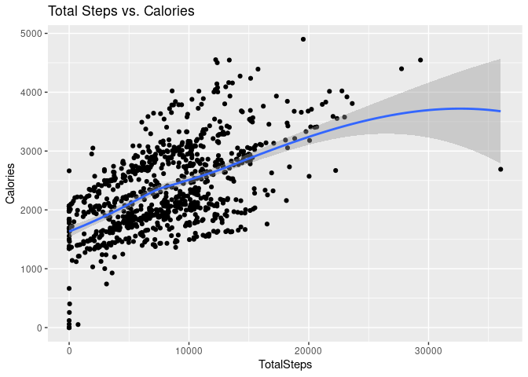
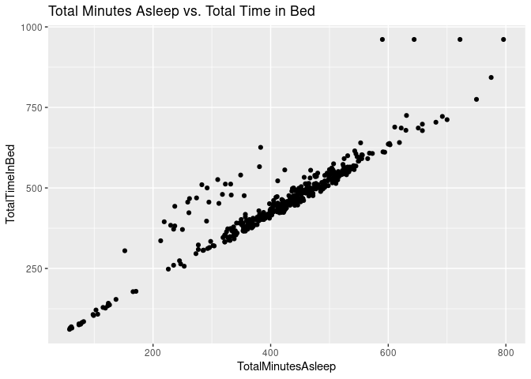
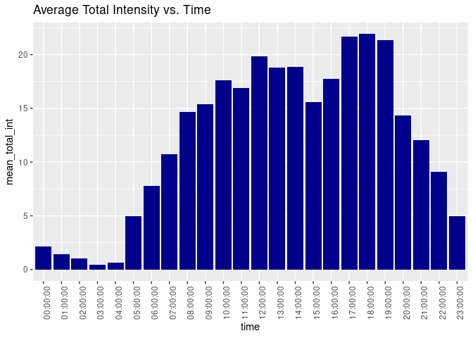
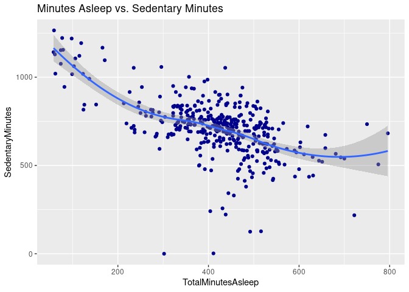

Projeto Google Capstone: Estudo de caso 2 - Como um compartilhamento de bicicletas alcança o sucesso rápido?

Luis Gustavo Cezar Puga

# Sobre uma empresa

Bellabeat, uma fabricante de alta tecnologia de produtos voltados para a
saúde das mulheres. É uma pequena empresa de sucesso, mas com um grande
potencial para expansão, principalmente no cenário global de
dispositivos inteligentes. Urška Sršen, cofundadora e diretora decriação
da Bellabeat, acredita que a análise de dados de condicionamento físico
de dispositivos inteligentes pode ajudar a desbloquear um novo
crescimento de oportunidades para a empresa. A tecnologia Bellabeat
ajuda a capacitar mulheres com conhecimento sobre sua própria saúde e
hábitos.

# Perguntas para a análise

1.  Quais são as tendências no uso de dispositivos inteligentes?
2.  Como estas tendências podem se aplicar aos clientes da Bellabeat?
3.  Como essas tendências podem ajudar a influenciar a estratégia de
    marketing da Bellabeat

# Tarefa de negócios

Identificar potenciais oportunidades de crescimento e recomendações para
o Melhoria da estratégia de marketing Bellabeat com base nas tendências
em dispositivos inteligentes uso.

# Fonte de Dados

- Kaggle: FitBit Fitness Tracker Data
  (<https://www.kaggle.com/datasets/arashnic/fitbit>)

- Kernel(s) Inicial(is): Anastasiia Chebotina:
  <https://www.kaggle.com/chebotinaa/bellabeat-case-study-with-r>  
  Julen Aranguren:
  <https://www.kaggle.com/code/foxsjl/bellabeat-product-analysis-a-capstone-project>  

- Reconhecimento:  
  Index of bucket “divvy-tripdata”
  <https://divvy-tripdata.s3.amazonaws.com/index.html>

# Carregando pacotes e diretório de trabalho

``` r
#setwd("/home/gustavo/Projetos/R/cyclistic-bike-share-a-case-study")
library(tidyverse)
```

    ## ── Attaching packages ─────────────────────────────────────── tidyverse 1.3.2 ──
    ## ✔ ggplot2 3.4.0      ✔ purrr   0.3.5 
    ## ✔ tibble  3.1.8      ✔ dplyr   1.0.10
    ## ✔ tidyr   1.2.1      ✔ stringr 1.5.0 
    ## ✔ readr   2.1.3      ✔ forcats 0.5.2 
    ## ── Conflicts ────────────────────────────────────────── tidyverse_conflicts() ──
    ## ✖ dplyr::filter() masks stats::filter()
    ## ✖ dplyr::lag()    masks stats::lag()

``` r
library(skimr)
```

# Importing datasets

``` r
activity <- read.csv("Data/Activity_Daily.csv")
calories <- read.csv("Data/Calories_Hourly.csv")
intensities <- read.csv("Data/Intensities_Hourly.csv")
sleep <- read.csv("Data/Sleep_Day.csv")
weight <- read.csv("Data/Weight_Log_Info.csv")
```

Já verifiquei os dados no Libre Office. Eu só preciso ter certeza que
tudo foi importado corretamente usando View() e head() funções.

``` r
head(activity)
```

    ##           Id ActivityDate TotalSteps TotalDistance TrackerDistance
    ## 1 1503960366    4/12/2016      13162          8.50            8.50
    ## 2 1503960366    4/13/2016      10735          6.97            6.97
    ## 3 1503960366    4/14/2016      10460          6.74            6.74
    ## 4 1503960366    4/15/2016       9762          6.28            6.28
    ## 5 1503960366    4/16/2016      12669          8.16            8.16
    ## 6 1503960366    4/17/2016       9705          6.48            6.48
    ##   LoggedActivitiesDistance VeryActiveDistance ModeratelyActiveDistance
    ## 1                        0               1.88                     0.55
    ## 2                        0               1.57                     0.69
    ## 3                        0               2.44                     0.40
    ## 4                        0               2.14                     1.26
    ## 5                        0               2.71                     0.41
    ## 6                        0               3.19                     0.78
    ##   LightActiveDistance SedentaryActiveDistance VeryActiveMinutes
    ## 1                6.06                       0                25
    ## 2                4.71                       0                21
    ## 3                3.91                       0                30
    ## 4                2.83                       0                29
    ## 5                5.04                       0                36
    ## 6                2.51                       0                38
    ##   FairlyActiveMinutes LightlyActiveMinutes SedentaryMinutes Calories
    ## 1                  13                  328              728     1985
    ## 2                  19                  217              776     1797
    ## 3                  11                  181             1218     1776
    ## 4                  34                  209              726     1745
    ## 5                  10                  221              773     1863
    ## 6                  20                  164              539     1728

Identifiquei alguns problemas com os dados do *timestamp* de data/hora.
Então, antes da análise, preciso convertê-los para o formato *data-hora*
e dividir em data e hora.

# Corrigindo a formatação

``` r
# intensities
intensities$ActivityHour=as.POSIXct(intensities$ActivityHour, format="%m/%d/%Y %I:%M:%S %p", tz=Sys.timezone())
intensities$time <- format(intensities$ActivityHour, format = "%H:%M:%S")
intensities$date <- format(intensities$ActivityHour, format = "%m/%d/%y")
# calories
calories$ActivityHour=as.POSIXct(calories$ActivityHour, format="%m/%d/%Y %I:%M:%S %p", tz=Sys.timezone())
calories$time <- format(calories$ActivityHour, format = "%H:%M:%S")
calories$date <- format(calories$ActivityHour, format = "%m/%d/%y")
# activity
activity$ActivityDate=as.POSIXct(activity$ActivityDate, format="%m/%d/%Y", tz=Sys.timezone())
activity$date <- format(activity$ActivityDate, format = "%m/%d/%y")
# sleep
sleep$SleepDay=as.POSIXct(sleep$SleepDay, format="%m/%d/%Y %I:%M:%S %p", tz=Sys.timezone())
sleep$date <- format(sleep$SleepDay, format = "%m/%d/%y")
```

Agora que tudo está pronto, posso começar a explorar os conjuntos de
dados.

# Explorando e resumindo dados

``` r
n_distinct(activity$Id)
```

    ## [1] 33

``` r
n_distinct(calories$Id)
```

    ## [1] 33

``` r
n_distinct(intensities$Id)
```

    ## [1] 33

``` r
n_distinct(sleep$Id)
```

    ## [1] 24

``` r
n_distinct(weight$Id)
```

    ## [1] 8

Esta informação nos alerta sobre o número de participantes em cada
conjunto de dados.

Há 33 participantes nos dados de atividade, calorias e intensidades
conjuntos, 24 no sono e apenas 8 no conjunto de dados de peso. 8
participantes não é significativo fazer recomendações e conclusões com
base em esses dados.

Vamos dar uma olhada nas estatísticas resumidas dos conjuntos de dados:

``` r
# activity
activity %>%  
  select(TotalSteps,
         TotalDistance,
         SedentaryMinutes, Calories) %>%
  summary()
```

    ##    TotalSteps    TotalDistance    SedentaryMinutes    Calories   
    ##  Min.   :    0   Min.   : 0.000   Min.   :   0.0   Min.   :   0  
    ##  1st Qu.: 3790   1st Qu.: 2.620   1st Qu.: 729.8   1st Qu.:1828  
    ##  Median : 7406   Median : 5.245   Median :1057.5   Median :2134  
    ##  Mean   : 7638   Mean   : 5.490   Mean   : 991.2   Mean   :2304  
    ##  3rd Qu.:10727   3rd Qu.: 7.713   3rd Qu.:1229.5   3rd Qu.:2793  
    ##  Max.   :36019   Max.   :28.030   Max.   :1440.0   Max.   :4900

``` r
print("___________________________________________________________")
```

    ## [1] "___________________________________________________________"

``` r
# explore num of active minutes per category
activity %>%
  select(VeryActiveMinutes, FairlyActiveMinutes, LightlyActiveMinutes) %>%
  summary()
```

    ##  VeryActiveMinutes FairlyActiveMinutes LightlyActiveMinutes
    ##  Min.   :  0.00    Min.   :  0.00      Min.   :  0.0       
    ##  1st Qu.:  0.00    1st Qu.:  0.00      1st Qu.:127.0       
    ##  Median :  4.00    Median :  6.00      Median :199.0       
    ##  Mean   : 21.16    Mean   : 13.56      Mean   :192.8       
    ##  3rd Qu.: 32.00    3rd Qu.: 19.00      3rd Qu.:264.0       
    ##  Max.   :210.00    Max.   :143.00      Max.   :518.0

``` r
print("___________________________________________________________")
```

    ## [1] "___________________________________________________________"

``` r
# calories
calories %>%
  select(Calories) %>%
  summary()
```

    ##     Calories     
    ##  Min.   : 42.00  
    ##  1st Qu.: 63.00  
    ##  Median : 83.00  
    ##  Mean   : 97.39  
    ##  3rd Qu.:108.00  
    ##  Max.   :948.00

``` r
print("___________________________________________________________")
```

    ## [1] "___________________________________________________________"

``` r
# sleep
sleep %>%
  select(TotalSleepRecords, TotalMinutesAsleep, TotalTimeInBed) %>%
  summary()
```

    ##  TotalSleepRecords TotalMinutesAsleep TotalTimeInBed 
    ##  Min.   :1.000     Min.   : 58.0      Min.   : 61.0  
    ##  1st Qu.:1.000     1st Qu.:361.0      1st Qu.:403.0  
    ##  Median :1.000     Median :433.0      Median :463.0  
    ##  Mean   :1.119     Mean   :419.5      Mean   :458.6  
    ##  3rd Qu.:1.000     3rd Qu.:490.0      3rd Qu.:526.0  
    ##  Max.   :3.000     Max.   :796.0      Max.   :961.0

``` r
print("___________________________________________________________")
```

    ## [1] "___________________________________________________________"

``` r
# weight
weight %>%
  select(WeightKg, BMI) %>%
  summary()
```

    ##     WeightKg           BMI       
    ##  Min.   : 52.60   Min.   :21.45  
    ##  1st Qu.: 61.40   1st Qu.:23.96  
    ##  Median : 62.50   Median :24.39  
    ##  Mean   : 72.04   Mean   :25.19  
    ##  3rd Qu.: 85.05   3rd Qu.:25.56  
    ##  Max.   :133.50   Max.   :47.54

**Algumas descobertas interessantes deste resumo:**

- O tempo médio sedentário é de 991 minutos ou 16 horas. definitivamente
  precisa ser reduzido!

- A maioria dos participantes é levemente ativa.

- Em média, os participantes dormem 1 vez por 7 horas.

- O total médio de passos por dia é de 7638, um pouco menos para tendo
  benefícios para a saúde de acordo com a pesquisa do CDC. Eles
  encontraram que dar 8.000 passos por dia foi associado a um risco 51%
  menor para todas as causas de mortalidade (ou morte por todas as
  causas). Levando 12.000 passos por dia foi associado a um risco 65%
  menor em comparação com dando 4.000 passos.

# Mesclando dados

Antes de começar a visualizar os dados, eu preciso fundir dois conjuntos
de dados. Vou fundir (união interna) ” activity” e “sleep” nas colunas
id e date (que eu criei anteriormente após converter os dados para o
formato de data e hora).

``` r
merged_data <- merge(sleep, activity, by=c('Id', 'date'))
head(merged_data)
```

    ##           Id     date   SleepDay TotalSleepRecords TotalMinutesAsleep
    ## 1 1503960366 04/12/16 2016-04-12                 1                327
    ## 2 1503960366 04/13/16 2016-04-13                 2                384
    ## 3 1503960366 04/15/16 2016-04-15                 1                412
    ## 4 1503960366 04/16/16 2016-04-16                 2                340
    ## 5 1503960366 04/17/16 2016-04-17                 1                700
    ## 6 1503960366 04/19/16 2016-04-19                 1                304
    ##   TotalTimeInBed ActivityDate TotalSteps TotalDistance TrackerDistance
    ## 1            346   2016-04-12      13162          8.50            8.50
    ## 2            407   2016-04-13      10735          6.97            6.97
    ## 3            442   2016-04-15       9762          6.28            6.28
    ## 4            367   2016-04-16      12669          8.16            8.16
    ## 5            712   2016-04-17       9705          6.48            6.48
    ## 6            320   2016-04-19      15506          9.88            9.88
    ##   LoggedActivitiesDistance VeryActiveDistance ModeratelyActiveDistance
    ## 1                        0               1.88                     0.55
    ## 2                        0               1.57                     0.69
    ## 3                        0               2.14                     1.26
    ## 4                        0               2.71                     0.41
    ## 5                        0               3.19                     0.78
    ## 6                        0               3.53                     1.32
    ##   LightActiveDistance SedentaryActiveDistance VeryActiveMinutes
    ## 1                6.06                       0                25
    ## 2                4.71                       0                21
    ## 3                2.83                       0                29
    ## 4                5.04                       0                36
    ## 5                2.51                       0                38
    ## 6                5.03                       0                50
    ##   FairlyActiveMinutes LightlyActiveMinutes SedentaryMinutes Calories
    ## 1                  13                  328              728     1985
    ## 2                  19                  217              776     1797
    ## 3                  34                  209              726     1745
    ## 4                  10                  221              773     1863
    ## 5                  20                  164              539     1728
    ## 6                  31                  264              775     2035

# Visualização

``` r
ggplot(data=activity, aes(x=TotalSteps, y=Calories)) + 
  geom_jitter() + geom_smooth() + labs(title="Total Steps vs. Calories")
```

    ## `geom_smooth()` using method = 'loess' and formula = 'y ~ x'

<!-- -->

Vejo aqui uma correlação positiva entre “Total Steps” e “Calories”, o
que é uma causalidade, pois quanto mais ativos passos damos, mais
calorias queimamos.

``` r
ggplot(data=sleep, aes(x=TotalMinutesAsleep, y=TotalTimeInBed)) + 
  geom_point()+ labs(title="Total Minutes Asleep vs. Total Time in Bed")
```

<!-- -->

A relação entre “Total Minutes Asleep” e “Total Time in Bed” parece
linear. Portanto, se os usuários do Bellabeat querem melhorar seu sono,
devemos considerar o uso da notificação para ir dormir.

Vamos olhar para os **dados de intensidade** ao longo do tempo (de hora
em hora).

``` r
int_new <- intensities %>%
  group_by(time) %>%
  drop_na() %>%
  summarise(mean_total_int = mean(TotalIntensity))

ggplot(data=int_new, aes(x=time, y=mean_total_int)) + geom_histogram(stat = "identity", fill='darkblue') +
  theme(axis.text.x = element_text(angle = 90)) +
  labs(title="Average Total Intensity vs. Time")
```

    ## Warning in geom_histogram(stat = "identity", fill = "darkblue"): Ignoring
    ## unknown parameters: `binwidth`, `bins`, and `pad`

<!-- -->

- Depois de visualizar “Intensidade Total por hora”, descobri que as
  pessoas são mais ativas entre 5 da manhã e 10 da noite.

- A maioria das atividades acontece entre 17h e 19h - suponho, que as
  pessoas vão a uma academia de ginástica ou para um passeio depois de
  terminar o trabalho. Podemos usar este tempo no aplicativo Bellabeat
  para lembrar e motivar os usuários a ir correr ou caminhar.

Vejamos a relação entre “Total Minutes Asleep” e “Sedentry Minutes”.

``` r
ggplot(data=merged_data, aes(x=TotalMinutesAsleep, y=SedentaryMinutes)) + 
geom_point(color='darkblue') + geom_smooth() +
  labs(title="Minutes Asleep vs. Sedentary Minutes")
```

    ## `geom_smooth()` using method = 'loess' and formula = 'y ~ x'

<!-- -->

- Aqui podemos ver claramente a relação negativa entre “Ata Sedentária”
  e “Hora do Sono”.

- Como uma idéia: se os usuários do Bellabeat querem melhorar seu sono,
  Bellabeat app pode recomendar a redução do tempo de sedentarismo.

- Tenha em mente que precisamos apoiar esta percepção com mais dados,
  pois a correlação entre alguns dados não significa causalidade.

# Resumindo as recomendações para o negócio

Como já sabemos, coletar dados sobre atividade, sono, estresse e saúde
reprodutiva permitiu que Bellabeat empoderasse mulheres com conhecimento
sobre sua própria saúde e hábitos. Desde que foi fundado em 2013,
Bellabeat cresceu rapidamente e rapidamente se posicionou como um
empresa de bem-estar voltada para a tecnologia para mulheres.

Depois de analisar os dados do FitBit Fitness Tracker, encontrei alguns
**insights isso ajudaria a influenciar a estratégia de marketing da
Bellabeat.**


**Público-alvo**

Mulheres que trabalham em tempo integral (de acordo com os dados de
intensidade horária) e passa muito tempo no computador/em reunião/focado
no trabalho estão fazendo (de acordo com os dados de tempo sedentário).

Essas mulheres fazem alguma atividade leve para se manterem saudáveis
(de acordo com o análise do tipo de atividade). Mesmo que eles precisem
melhorar seu cotidiano atividade tenha benefícios para a saúde. Eles
podem precisar de algum conhecimento sobre desenvolver hábitos saudáveis
ou motivação para continuar.

- Como não há informações de gênero sobre os participantes, presumi que
  todos os gêneros foram apresentados e equilibrados neste conjunto de
  dados.

**A principal mensagem da campanha on-line do Bellabeat**

O aplicativo Bellabeat não é apenas mais um aplicativo de atividades
físicas. é um guia (uma amiga) que empodera as mulheres para equilibrar
a vida pessoal e profissional vida e hábitos e rotinas saudáveis,
educando-os e motivando-os por meio de recomendações diárias de
aplicativos.

**Ideias para o aplicativo Bellabeat**

1.  O total médio de passos por dia é de 7.638, um pouco menos para
    tendo benefícios para a saúde de acordo com a pesquisa do CDC. Eles
    encontraram que dar 8.000 passos por dia foi associado a um risco
    51% menor para todas as causas de mortalidade (ou morte por todas as
    causas). Levando 12.000 passos por dia foi associado a um risco 65%
    menor em comparação com dando 4.000 passos. Bellabeat pode encorajar
    as pessoas a tomar pelo menos 8 000 explicando os benefícios para a
    sua saúde.

2.  Se os usuários desejam perder peso, provavelmente é uma boa ideia
    controlar consumo calórico diário. Bellabeat pode sugerir algumas
    ideias para almoço e jantar de baixa caloria.

3.  Se os usuários quiserem melhorar o sono, o Bellabeat deve considerar
    usando notificações de aplicativos para ir para a cama.

4.  A maioria das atividades acontece entre 17h e 19h - suponho que as
    pessoas vá a uma academia ou dê um passeio depois de terminar o
    trabalho. Bellabeat pode usar desta vez para lembrar e motivar os
    usuários a correr ou caminhar.

5.  Uma ideia: se o usuário quiser melhorar o sono, o aplicativo
    Bellabeat pode recomendar a redução do tempo sedentário.
